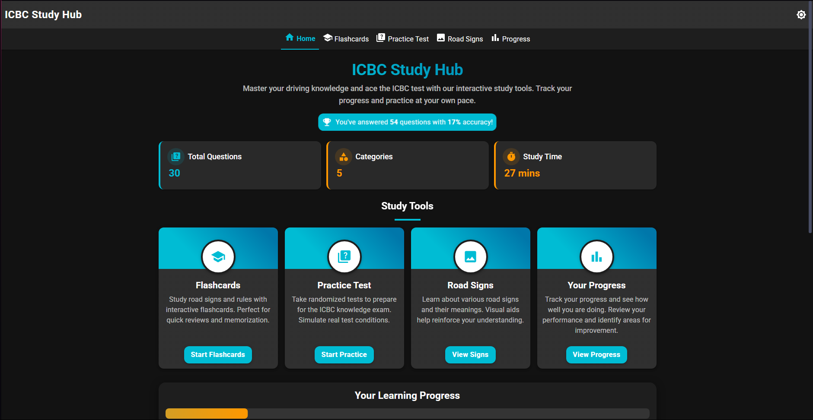

# ICBC Study Hub

A comprehensive study application for the ICBC knowledge test. Practice with flashcards, quizzes, and road signs.



## Features

- Interactive flashcards with flip animations
- Practice tests with multiple-choice questions
- Road sign recognition practice
- Progress tracking
- Mobile-responsive design
- Dark mode support

## Quick Start

### Run with npm

```bash
# Install dependencies
npm install

# Start the development server
npm start

# Build for production
npm run build
```

### Run with Docker

```bash
# Build and run with Docker Compose
docker-compose up -d

# Stop the container
docker-compose down
```

## Deploying with Pterodactyl

### Prerequisites

- A running Pterodactyl panel
- Admin access to create eggs

### Steps

1. Log in to your Pterodactyl panel as an admin
2. Go to the "Nests" section
3. Create a new nest or use an existing one
4. Upload the `pterodactyl.json` egg file from this repository
5. Create a new server using the ICBC Study Hub egg
6. Configure the server variables as needed
7. Install the server and start it

### Docker Image

You can also use the pre-built Docker image:

```bash
docker pull ghcr.io/yourusername/icbc-study-hub:latest
```

## Configuration

### Environment Variables

- `PORT` - The port to run the application on (default: 3000)
- `NODE_ENV` - The environment to run in (development or production)

## Development

### Project Structure

```
.
├── public/              # Static assets
├── src/                 # Source code
│   ├── components/      # React components
│   ├── contexts/        # React contexts
│   ├── data/            # Data files and services
│   ├── pages/           # Page components
│   ├── theme/           # Theme configuration
│   ├── App.js           # Main App component
│   └── index.js         # Entry point
├── .dockerignore        # Docker ignore file
├── Dockerfile           # Docker build instructions
├── docker-compose.yml   # Docker Compose configuration
├── pterodactyl.json     # Pterodactyl egg configuration
└── README.md            # This file
```

## License

This project is licensed under the MIT License.

## Contributing

Contributions are welcome! Please feel free to submit a Pull Request. 